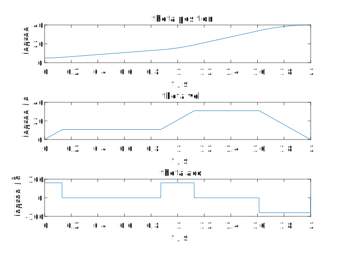
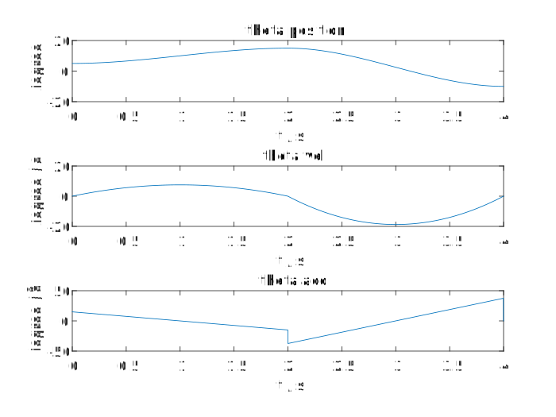

## Robotics Hw8

#### 1. T1

梯形速度规划(LFBS)曲线结果如图1所示, 其Matlab程序详见 ‘HW8.m_LFPB节’。

    
     
    
图1 梯形速度规划曲线结果

#### 2. T2

三次多项式规划(Cubic)曲线结果如图2所示,  其Matlab程序详见‘HW8.m_Cubic节’。

    
     
    
图2 三次多项式规划曲线结果

